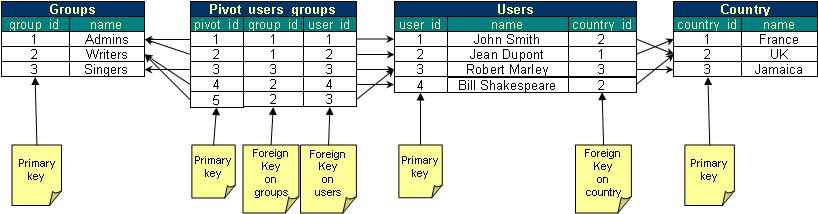

Automatically guess JOINs with MagicJoin!
-----------------------------------------

Fed up of writing joins in SQL? Let MagicQuery do the work for you!

Seriously? Yes! All you have to do is:

- Pass a **Doctrine DBAL connection** to MagicQuery's constructor. MagicQuery will analyze your schema.
- In your SQL query, replace the tables with `magicjoin(start_table)`
- For each column of your query, use the complete name ([table_name].[column_name] instead if [column_name] alone)

Let's assume your database schema is:



Using MagicJoin, you can write this SQL query:
 
```sql
SELECT users.* FROM MAGICJOIN(users) WHERE groups.name = 'Admins' AND country.name='France';
```

and it will automatically be transformed into this:

```sql
SELECT users.* FROM users 
	LEFT JOIN users_groups ON users.user_id = users_groups.user_id
 	LEFT JOIN groups ON groups.group_id = users_groups.group_id
 	LEFT JOIN country ON country.country_id = users.country_id
WHERE groups.name = 'Admins' AND country.name='France';
```

And the code is so simple!

```php
use Mouf\Database\MagicQuery;

$sql = "SELECT users.* FROM MAGICJOIN(users) WHERE groups.name = 'Admins' AND country.name='France'";

// Get a MagicQuery object.
// $conn is a Doctrine DBAL connection.
$magicQuery = new MagicQuery($conn);

$completeSql = $magicQuery->build($sql);
// $completeSql contains the complete SQL request, with all joins.
```

###How does it work?

When you reference a column, you have to give its full name in the form **[table_name].[column_name]**.
Because each column is referenced by its full name, MagicJoin is able to build a list of tables that
need to be joined.

Then, MagicJoin scans your data model. Using **foreign keys**, it discovers the relationship between
tables by itself. Then, it finds the **shortest path** between you "main" table and all the other tables that are
needed.

From this shortest path, it can build the correct JOINs.

Now that you understand the concept, you should understand the power and the limits of MagicJoin.

- MagicJoin **cannot generate queries with recursive relationships** (like a parent/child relationship)
- MagicJoin assumes you are looking for the shortest path between 2 tables
    - This is 80% of the case true
    - If you are in the remaining 20%, do not use MagicJoin
    
<div class="alert alert-warning">MagicJoin is meant to be used on the 80% of the cases where writing joins is trivial
and boring. If you have complex joins, do not try to use MagicJoin. Go back to pure SQL instead.</div>
