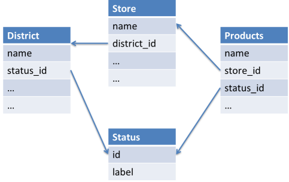

Automatically guess JOINs with MagicJoin!
-----------------------------------------

Fed up of writing joins in SQL? Let MagicQuery do the work for you!

Seriously? Yes! All you have to do is:

- Pass a **Doctrine DBAL connection** to MagicQuery's constructor. MagicQuery will analyze your schema.
- In your SQL query, replace the tables with `magicjoin(start_table)`
- For each column of your query, use the complete name ([table_name].[column_name] instead of [column_name] alone)

Let's assume your database schema is:


Using MagicJoin, you can write this SQL query:
 
```sql
SELECT users.* FROM MAGICJOIN(users) WHERE groups.name = 'Admins' AND country.name='France';
```

and it will automatically be transformed into this:

```sql
SELECT users.* FROM users 
	LEFT JOIN users_groups ON users.user_id = users_groups.user_id
 	LEFT JOIN groups ON groups.group_id = users_groups.group_id
 	LEFT JOIN country ON country.country_id = users.country_id
WHERE groups.name = 'Admins' AND country.name='France';
```

And the code is so simple!

```php
use Mouf\Database\MagicQuery;

$sql = "SELECT users.* FROM MAGICJOIN(users) WHERE groups.name = 'Admins' AND country.name='France'";

// Get a MagicQuery object.
// $conn is a Doctrine DBAL connection.
$magicQuery = new MagicQuery($conn);

$completeSql = $magicQuery->build($sql);
// $completeSql contains the complete SQL request, with all joins.
```

###How does it work?

When you reference a column, you have to give its full name in the form **[table_name].[column_name]**.
Because each column is referenced by its full name, MagicJoin is able to build a list of tables that
need to be joined.

Then, MagicJoin scans your data model. Using **foreign keys**, it discovers the relationship between
tables by itself. Then, it finds the **shortest path** between you "main" table and all the other tables that are
needed.

From this shortest path, it can build the correct JOINs.

Now that you understand the concept, you should understand the power and the limits of MagicJoin.

- MagicJoin **cannot generate queries with recursive relationships** (like a parent/child relationship). This is 
  because parent/child relationships are represented by loops in the dependency graph, and a loop is never the
  shortest path.
- MagicJoin assumes you are looking for the shortest path between 2 tables
    - This is 80% of the case true
    - If you are in the remaining 20%, do not use MagicJoin
    
<div class="alert alert-warning">MagicJoin is meant to be used on the 80% of the cases where writing joins is trivial
and boring. If you have complex joins, do not try to use MagicJoin. Go back to pure SQL instead.</div>

If you are looking for details on how this shortest path is computed, have a look at 
[mouf/schema-analyzer](http://mouf-php.com/packages/mouf/schema-analyzer/README.md) which is the package in charge
of computing that shortest path.

###Ambiguity exceptions and fine-tuning

Sometimes, there can be 2 possible paths that link 2 tables and that are equally short.
In this case, rather than choosing a path at random, MagicQuery will let you know there is a problem by issuing
a `ShortestPathAmbiguityException`.



Let's have a look at the example above. We have *products* that are part of a *store*. Stores are part of a *district*.
Both *districts* and *products* have a *status*.

Now, let's have a look at this query:

```sql
SELECT products.* FROM MAGICJOIN(products) WHERE district.name = 'NY';
```

Very obviously, we want all the products from the district. Bu for MagicJoin, this is far from obvious.
There are really 2 paths from products to district. One is going through the "store" table and one through the "status"
table. Those paths are equally short.

We need to *hint* MagicJoin into understanding that the "status" table is irrelevant.

To do this, we must first provide to MagicJoin an instance of `SchemaAnalyzer`. [`SchemaAnalyzer` is the underlying
package that is in charge of computing the shortest path.](http://mouf-php.com/packages/mouf/schema-analyzer/README.md)

```php
use Mouf\Database\MagicQuery;
use Mouf\Database\SchemaAnalyzer\SchemaAnalyzer;

// $conn is a Doctrine DBAL connection.
// $cache is a Doctrine Cache

// Get a SchemaAnalyzer object.
$schemaAnalyzer = new SchemaAnalyzer($conn->getSchemaManager(), $cache, "some_unique_key");

// On SchemaAnalyzer, let's modify the cost of the "status" table to make it unlikely to be used:
$schemaAnalyzer->setTableCostModifier("status", SchemaAnalyzer::WEIGHT_IRRELEVANT);

// Get a MagicQuery object.
$magicQuery = new MagicQuery($conn, $cache, $schemaAnalyzer);

$completeSql = $magicQuery->build("SELECT products.* FROM MAGICJOIN(products) WHERE district.name = 'NY'");
```

The call to `setTableCostModifier` above will explain to MagicJoin that the *status* table is mostly irrelevant, 
and that it should most of the time be avoided.

You can also set a *cost* on a single foreign key rather than on a table. For instance:

```php
// Avoid using the "status_id" foreign_key from the "products" table.
$schemaAnalyzer->setForeignKeyCost("products", "status_id", SchemaAnalyzer::WEIGHT_IRRELEVANT);
```

###With great power comes great responsibility

MagicJoin is a powerful feature because it can **guess** what you want to do. Please be wise while using it.
A change in your model could modify the shortest path computed by MagicJoin and therefore the returned SQL query.

If you database model is complex enough and is rapidly changing, generated queries could suddenly change in 
your application.

Please consider one of these 2 options:

- write unit tests (you have unit tests, don't you?)
- use MagicJoin in development mode only. While developing, dump the SQL generated by MagicJoin and put it back
  in your code.
